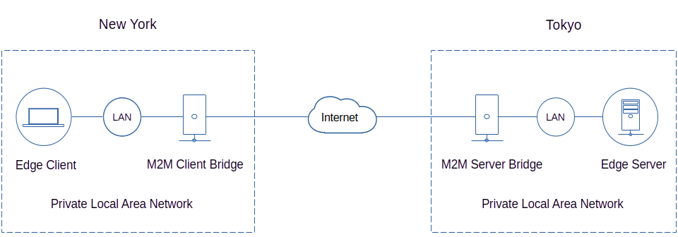

## M2M Bridge Gateway


In this example, an edge client from New York city will try to access an edge server from Tokyo city. The communication path will start from an edge client connecting to the m2m bridge client gateway located in New York through a private local area network. It will then connect through an m2m server gateway located in Tokyo traversing the public internet. Then finally connecting through a private local network to an edge server.  

All communications traffic are fully encrypted using TLS and a combination of standard public and private encryption methods.  

<br>

#### 1. Create a project directory for each endpoint and install *m2m*.
#### 2. Copy the code correspondingly from each endpoint and save it as app.js file.
#### 3. Start each application using the saved app.js file one by one from each endpoint.
```js
$ node app.js
```
### Edge Client
```js
const m2m = require('m2m')

let edge = new m2m.Edge({name:'edge client'})

async function main (){
  await m2m.connect()
    
  /***************
 
     Edge client
  
   ***************/
  let edgeClient = new edge.client(8140) // port 8140 using localhost ip
  
  edgeClient.on('ready', (result) => {
    console.log('edge server 8140 ready', result) // should be true if up and false if down
  })  
  
  edgeClient.on('error', (error) => {
    console.log('edge client error', error)
  })
  
  edgeClient.write('edge-data-source-1', 'sensor-1', (data) => {
    console.log('write', data)
  })

  edgeClient.subscribe('edge-publish-data-1', (data) => {
    console.log('sub', data)
    if(data.value < 30){
      edgeClient.write('edge-data-source-1', 'sensor-2')
    }
    else if(data.value > 105){
      edgeClient.write('edge-data-source-1', 'sensor-1')
    } 
  })
}

main()
```
### M2M Client Bridge
```js
const m2m = require('m2m')
  
let client = new m2m.Client({name:'m2m client bridge'})
let edge = new m2m.Edge({name:'edge server'})

let currentValue = ''

async function main (){
  await m2m.connect()

  /**************
 
     M2M Client
  
   **************/
  let m2mClient = new client.access(300) // m2m virtual port 300
  
  m2mClient.subscribe('m2m-bridge-2', (data) => {
    currentValue = data
  })  

  /****************
 
     Edge Server
  
   ****************/
  const edgeServer = edge.createServer(8140) // port 8140 using localhost ip

  edgeServer.dataSource('edge-data-source-1', async (tcp) => {
    let result = ''
    // write 
    if(tcp.payload){
      result = await m2mClient.write('m2m-bridge-1', tcp.payload )
    }
    // read
    else{
      result = await m2mClient.read('m2m-bridge-1')
    }
    tcp.send(result)   
  })
  
  edgeServer.publish('edge-publish-data-1', async (tcp) => {
    tcp.send(currentValue)  
  })  
}

main()
```
### M2M Server Bridge
```js
const m2m = require('m2m')  

let m2mServer = new m2m.Server(300) // m2m virtual port 300

let edge = new m2m.Edge({name:'edge client'})

async function main (){
  await m2m.connect()
  
  /**************
 
    Edge client
  
   **************/
  let edgeClient = new edge.client(8150) // port 8150 using localhost ip
  
  edgeClient.on('ready', (result) => {
    console.log('edge server 8150 ready', result) // should be true if up and false if down
  })
  
  edgeClient.on('error', (error) => {
    console.log('edge client error', error)
  })    
  
  /**************
 
     M2M Server
  
   **************/
  m2mServer.dataSource('m2m-bridge-1', async (ws) => {
  let result = ''
  // write
  if(ws.payload){
    result = await edgeClient.write('edge-data-source-1', ws.payload)
  }
  // read
  else {
    result = await edgeClient.read('edge-data-source-1')
  }
    ws.send(result)
  })
  
  m2mServer.publish('m2m-bridge-2', async (ws) => {
    let result = await edgeClient.read('edge-data-source-1')
    ws.send(result)
  })
}

main()
```
### Edge Server
```js
const m2m = require('m2m')

let edge = new m2m.Edge({name:'edge server'})

let currentSensor = 'sensor-1'

function sensor1(){
  return 25 + Math.floor(Math.random() * 10)
}

function sensor2(){
  return 100 + Math.floor(Math.random() * 10)
}

async function main (){
  await m2m.connect()
  
  /****************
 
     Edge Server
  
   ****************/
  const edgeServer = edge.createServer(8150) // port 8150 using localhost ip
  
  edgeServer.dataSource('edge-data-source-1', (tcp) => {
    // write
    if(tcp.payload){
      currentSensor = tcp.payload
      tcp.send({topic:tcp.topic, currentSensor:currentSensor})       
    }
    // read
    else{
      if(currentSensor === 'sensor-1'){
        tcp.send({topic:tcp.topic, sensor:currentSensor, value:sensor1()}) 
      }
      else if(currentSensor === 'sensor-2'){
        tcp.send({topic:tcp.topic, sensor:currentSensor, value:sensor2()}) 
      }
      else{
        tcp.send({topic:tcp.topic, result:'invalid sensor'}) 
      }
    }
  })
}

main()
```
On the **edge client**, you should see a similar result as shown below.
```js
edge server 8140 ready true
sub { topic: 'edge-data-source-1', sensor: 'sensor-1', value: 32 }
write { topic: 'edge-data-source-1', currentSensor: 'sensor-1' }
sub { topic: 'edge-data-source-1', sensor: 'sensor-1', value: 27 }
sub { topic: 'edge-data-source-1', sensor: 'sensor-2', value: 101 }
...
```


