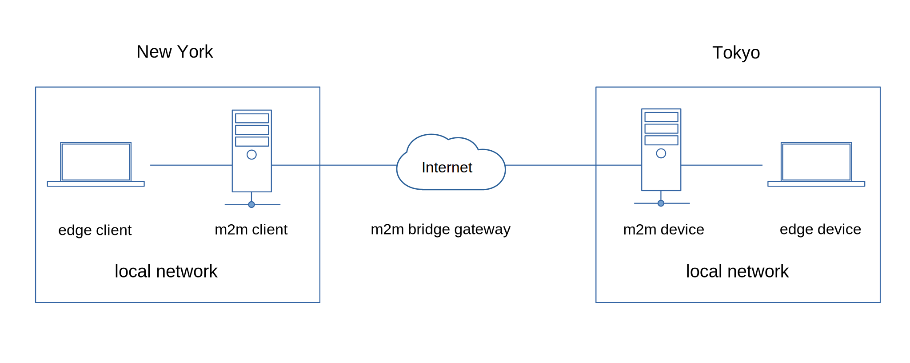

## M2M Brige Gateway


<br>

### Edge Client

#### 1. Create an edge client project directory and install *m2m*.

```js
const m2m = require('m2m')

/***
 * edge client
 */

let ec = new m2m.edge.client({port:8140, secure:true, restart:true})

ec.write('edge-data-source-1', {myData:130}, (data) => {
     console.log(data.toString())
})

ec.on('error', (err) => {
    console.log('error', err.message)
})
```
#### 3. Start your device application.

```js
$ node device.js
```

### M2M Client
```js
const m2m = require('m2m')  

// m2m client
let client = new m2m.Client()

client.connect(() => {

    let device = client.accessDevice(300)

    // edge server
    const server = m2m.edge.createServer(8140)

    server.dataSource('edge-data-source-1', (tcp) => {
        if(tcp.payload){
            device.write('m2m-bridge-1', tcp.payload )
            tcp.send('ack rcvd data')
        }
    })
})
```

### M2M Device
```js
const m2m = require('m2m')  

// m2m device 300
let device = new m2m.Device(300)

device.connect(() => {

    // edge client
    let ec = new m2m.edge.client({port:8150, secure:true, restart:true})

    // m2m data source
    device.dataSource('m2m-bridge-1', (ws) => {
        if(ws.payload){
            ec.write('edge-data-source-1', ws.payload)
        }
    })

})
```

### Edge Device
```js
const m2m = require('m2m')

/***
 * edge device
 */

const server = m2m.edge.createServer(8150) 

server.dataSource('edge-data-source-1', (tcp) => {
    if(tcp.payload){
       console.log('edge-data-source-1 rcvd data', tcp.payload)
       tcp.end() 
    }
})

```

#### 3. Start the edge device application.

```js
$ node device.js
```
You should get a similar result as shown below.
```js
edge-data-source-1 rcvd data { myData: 130 }


```


