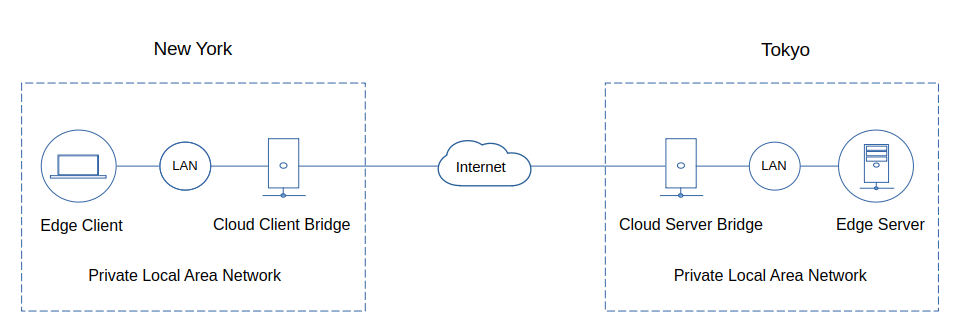

## Cloud Bridge Gateway


In this example, an edge client from New York city will try to access an edge server from Tokyo city.

The communication path will start from an edge client connecting through a cloud client bridge gateway located in New York city. It will then communicate through a cloud server bridge gateway located in Tokyo traversing the public internet. Then finally connecting to an edge server and accessing its available resources.  

All communications traffic along the path are fully encrypted using TLS and a combination of standard public and private encryption methods.  


#### 1. Create a project directory for each endpoint and install *m2m*.
#### 2. Copy the code correspondingly from each endpoint and save it as app.js file.
#### 3. Start each application using the saved app.js file one by one from each endpoint.
```js
$ node app.js
```
### Edge Client
```js
const m2m = require('m2m')

// Note: Create a standalone edge client 

async function main (){
 
	let edge = new m2m.Edge({name:'edge client'})

	await m2m.authenticate()
   /***************************

		New York Edge client

	****************************/
	let ec = new edge.client(8145) // access edge server port 8145 using localhost ip

	ec.on('ready', (result) => {
		console.log('edge server 8145 ready', result) 
	})  

	ec.on('error', (error) => {
		console.log('edge client error', error)
	})

	let wd = await ec.write('edge-data-source-1', 'sensor-1') 
	console.log('ec.write edge-data-source-1:', wd)

	let rd = await ec.read('edge-data-source-1') 
	console.log('ec.read edge-data-source-1:', rd)

	ec.sub('edge-publish-data-1', (data) => {
		console.log('ec.sub edge-publish-data-1:', data)
		if(data.value < 30){
		  	ec.write('edge-data-source-1', 'sensor-2')
		}
		else if(data.value > 100){
		  	ec.write('edge-data-source-1', 'sensor-1')
		} 
	})
}

main()
```
### Cloud Client Bridge
```js
const m2m = require('m2m')

// Note: Create a cloud client with an edge sub component 

async function main (){

	/**********************************************

		New York Cloud Client w/ Edge Component

	 **********************************************/
	let cc = new m2m.Cloud({type:'client', name:'NY client bridge', location:'Paris'})

	let edge = new m2m.Edge({name:'NY edge server'})

    await m2m.authenticate()

	cc.on('error', (e) => {
    	if(e.message){
      		console.log('*cloud client error:', e.message)
    	}
		console.log('cloud client error:', e)
  	})
	
	/**************************

		New York Edge Server

	 **************************/
	let es = edge.createServer(8145) // port 8145 using localhost ip

	es.publish('edge-publish-data-1', async (tcp) => {
		try{
			let result = await cc.read(400, 'tokyo-gateway-data-source') 
			console.log('edge pub edge-publish-data-1 - cc read tokyo-gateway-data-source:', result)
			tcp.send(result)
		}
		catch(e){
			console.log('await pub edge-publish-data-1 - cc.read error:', e.message)
		} 
	})

	es.dataSource('edge-data-source-1', async (tcp) => {
		let result = ''
		// write 
		if(tcp.payload){
			try{
				result = await cc.write(400, 'tokyo-gateway-data-source', tcp.payload) 
				console.log('cc write tokyo-gateway-data-source result', result) 
			}
			catch(e){
				console.log('*cc write tokyo-gateway-data-source error:', e.message)
			} 	
		}
		// read
		else{
		  	try{
				result = await cc.read(400, 'tokyo-gateway-data-source')
				console.log('cc read tokyo-gateway-data-source result', result) 
			}
			catch(e){
				console.log('*cc read tokyo-gateway-data-source error:', e.message)
			} 	
		}
		tcp.send(result)   
	})
}

main()
```
### Cloud Server Bridge
```js
const m2m = require('m2m')  

// Note: Create a cloud server with an edge sub component 
 
async function main (){

	/******************************************

		Tokyo Cloud Server w/ Edge Component

	*******************************************/
	let cs = new m2m.Cloud({type:'server', port:400}) // 400 is the cloud server id or virtual port

	let edge = new m2m.Edge({name:'Tokyo edge client'})

	await m2m.authenticate()

	/***********************

		Tokyo Edge client

	************************/
	let ec = new edge.client(8150) // access edge server port 8150 using localhost ip

	ec.on('ready', (result) => {
		console.log('edge server 8150 ready', result) 
	})

	ec.on('error', (error) => {
		console.log('edge client error', error)
	})    

	let result = ''
	cs.dataSource('tokyo-gateway-data-source', async (ws) => { 
		// write
		if(ws.payload){
		  	result = await ec.write('edge-data-source-1', ws.payload)
		}
		// read
		else {
		  	result = await ec.read('edge-data-source-1')
		}
		ws.send(result)
	})
}

main()
```
### Edge Server
```js
const m2m = require('m2m')

let currentSensor = 'sensor-1'

function sensor1(){
  	return 25 + Math.floor(Math.random() * 10)
}

function sensor2(){
  	return 100 + Math.floor(Math.random() * 25)
}

// Note: Create a standalone edge server  

async function main (){
		
	let edge = new m2m.Edge({name:'Tokyo edge server'})

  	await m2m.authenticate()
  
	/***********************

		Tokyo Edge Server

 	 ***********************/
	let es = edge.createServer(8150) // port 8150 using localhost ip

	es.dataSource('edge-data-source-1', (tcp) => {
		// write
		if(tcp.payload){
		  	currentSensor = tcp.payload
		  	tcp.send({topic:tcp.topic, currentSensor:currentSensor})       
		}
		// read
		else{
		  	if(currentSensor === 'sensor-1'){
				tcp.send({topic:tcp.topic, sensor:currentSensor, value:sensor1()}) 
		  	}
		  	else if(currentSensor === 'sensor-2'){
				tcp.send({topic:tcp.topic, sensor:currentSensor, value:sensor2()}) 
		  	}
		  	else{
				tcp.send({topic:tcp.topic, result:'invalid sensor'}) 
		  	}
		}
	})
}

main()
```
On the **edge client** output result, you should see a similar result as shown below.
```js
edge server 8145 ready true
ec.write edge-data-source-1: { topic: 'edge-data-source-1', currentSensor: 'sensor-1' }
ec.read edge-data-source-1: { topic: 'edge-data-source-1', sensor: 'sensor-1', value: 34 }
ec.sub edge-publish-data-1: { topic: 'edge-data-source-1', sensor: 'sensor-1', value: 26 }
ec.sub edge-publish-data-1: { topic: 'edge-data-source-1', sensor: 'sensor-2', value: 105 }
ec.sub edge-publish-data-1: { topic: 'edge-data-source-1', sensor: 'sensor-1', value: 32 }
ec.sub edge-publish-data-1: { topic: 'edge-data-source-1', sensor: 'sensor-1', value: 25 }
ec.sub edge-publish-data-1: { topic: 'edge-data-source-1', sensor: 'sensor-2', value: 100 }
...

```


